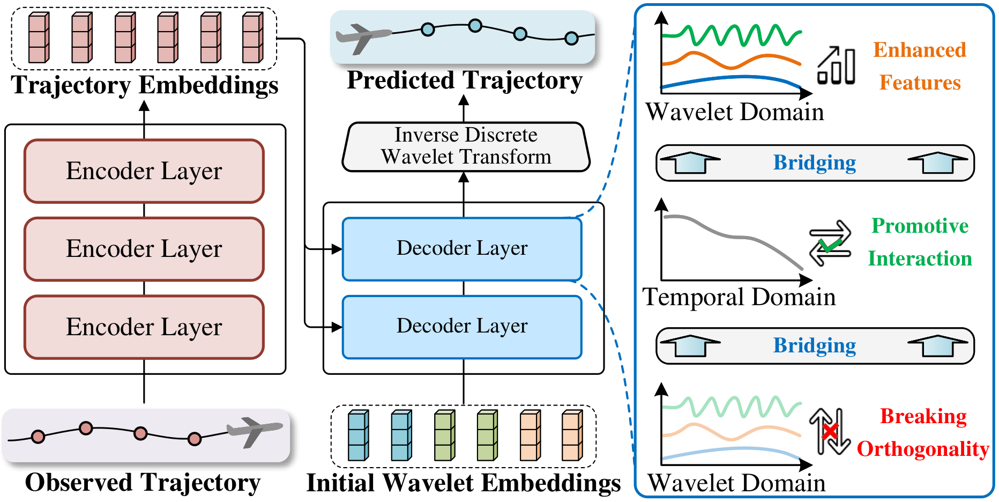

# Multi-horizon flight trajectory prediction enabled by time-frequency wavelet transform

# Introduction

This repository provides source codes of the WTFTP+ framework, which is an enhanced version of the previous work (<a href="https://www.nature.com/articles/s41467-023-40903-9">WTFTP</a>).
The repository of WTFTP can be accessed <a href="https://github.com/MusDev7/wtftp-model">here</a>.
This is a novel wavelet-based flight trajectory prediction framework by incorporating direct multi-horizon prediction paradigm and time-frequency bridging mechanism to address multi-horizon performance bottleneck of WTFTP. 

<p  align="middle"></p>

## Repository Structure
```
wtftp_plus
 ├─data_range.npy (Provide data ranges for normalization and denormalization)
 ├─dataloader.py (Load trajectory data from ./data)
 ├─LICENSE (LICENSE file)
 ├─model.py (The neural architecture corresponding to the WTFTP+ framework)
 ├─module.py (Modules to build WTFTP+ framework)
 ├─README.md (The current README file)
 ├─test.py (Perform the prediction procedure)
 ├─train.py (The main file for the model training and testing)
 ├─utils.py (Tools for the project)
 ├─data
 │  ├─README.md (README file for the dataset)
 │  ├─dev (Archive for the validation data)
 │  ├─test (Archive for the test data)
 │  └─train (Archive for the training data)
 ├─optDir
 │  └─train (Archive for the training data)
 └─pytorch_wavelets (The PyTorch implementation of wavelet transform)

```

## Package Requirements

+ Python == 3.7.1
+ torch == 1.9.0 + cu110
+ numpy == 1.18.5
+ matplotlib == 3.2.1
+ tensorboardX == 1.8
+ PyWavelets == 1.3.0


# Instructions
## Installation

### Clone this repository

```
git clone https://github.com/MusDev7/wtftp_plus.git
```

### Create proper software and hardware environment

You are recommended to create a virtual environment with the package requirements mentioned above and conduct the 
training and test on the suggested system configurations.

## Training
To train the WTFTP+ framework, use the following command.

```
python train.py --opt optDir/opt.json
```


### Description of hyperparameters
The main arguments in `opt.json` are described below:

`lr`: Float. The learning rate of the Adam optimizer. `default=0.001`

`interval`: Integer. The sampling period for dataloader. `default=5`

`batch_size`: Integer. The number of samples in a single training batch. `default=64`

`epoch`: Integer. The maximum epoch for the training process. `default=150`

`data_path`: String. The path for the dataset. `default='./data/'`

`logdir`: String. The save path of the models and log file during the training/testing process. `default='./log/'`

`n_layer_encoder`: Integer. The layer number of the Transformer encoder. `default=2`

`n_layer_decoder`: Integer. The layer number of the improved Transformer decoder. `default=4`

`pre_len`: Integer. The prediction horizon of the flight trajectory prediction task. `default=15`

`his_len`: Integer. The historical steps of the flight trajectory prediction task. `default=9`

`is_training`: Bool. Used to specify the running mode, true for training and false for testing. `default=true`

`d_model`: Integer. The dimension of feature embeddings. `default=128`

`n_head`: Integer. The head number of multi-head attention mechanism. `default=4`

`d_input`: Integer. The attribute number of input trajectory. `default=6`

`d_output`: Integer. The attribute number of output trajectory. `default=6`

`wavelet`: String. The wavelet basis. `default=haar`

`extendMode`: String. Signal extending mode. `default=symmetric`

`dropout`: Float. Probability of an element to be zeroed in Dropout function. `default=0.0`

`saving_model_num`: Integer. The number of models to be saved during the training process. `default=10`


## Test
```
python test.py --logdir [your log directory] --cuda
```
### Description of hyperparameters
The main arguments are described below:

`--netdir`: String. The path of exact model file. `default=""`

`--logdir`: String. The path of training log directory which contains saved models. This argument is required. If the `--netdir` is not empty, the code will prioritize using the model specified by this parameter.


# Dataset

In this repository, the example samples `./data/` are provided to facilitate quick start. 
The guidance about the example data can be found in `/data/README`. 


# Acknowledgement

The PyTorch implementation of wavelet transform is utilized to support the procedure of the DWT and IDWT procedures 
in this work. Its repository can be accessed [here](https://github.com/fbcotter/pytorch_wavelets). 
Thank all contributors to this project.


# Contact

Zheng Zhang (waiwainod@outlook.com, zhaeng@stu.scu.edu.cn)

Dongyue Guo (dongyueguo@scu.edu.cn)


